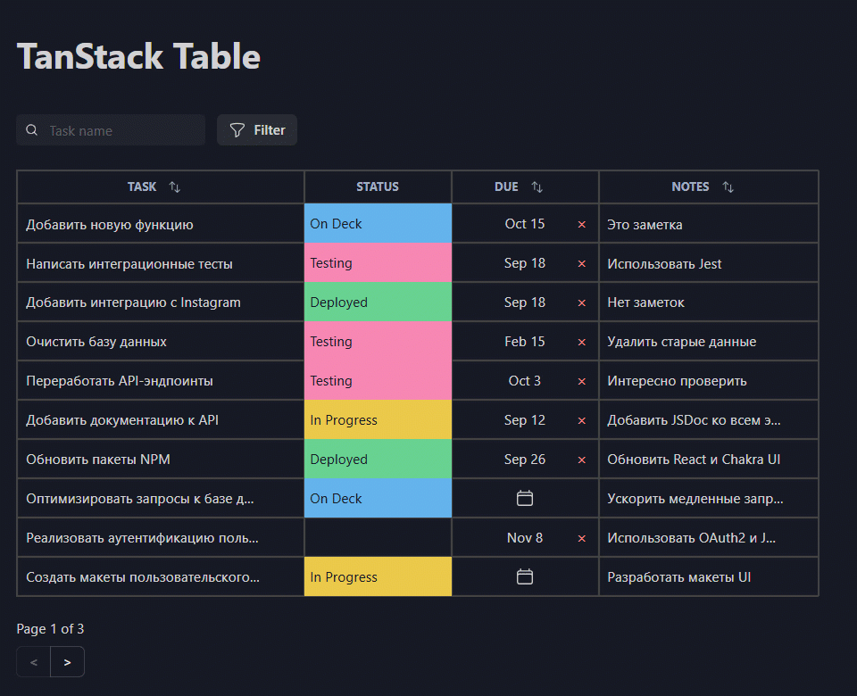

# TanStack Table

This project showcases advanced table functionalities such as custom filtering, sorting, pagination, and column resizing, styled with Chakra UI for a modern and responsive design.

---




---

## ✨ Features

- **Custom Filtering**: Filter table data dynamically based on user input.
- **Sorting**: Sort table columns in ascending or descending order.
- **Pagination**: Navigate through large datasets with ease.
- **Column Resizing**: Adjust column widths interactively.
- **Responsive Design**: Styled with Chakra UI for a polished and accessible UI.
- **TypeScript Support**: Fully typed for better developer experience.

## 🛠️ Technologies Used

- **[React](https://react.dev/reference)**: JavaScript library for building user interfaces.
- **[TanStack Table](https://tanstack.com/table/v8/docs)**: Powerful library for building dynamic tables.
- **[Chakra UI](https://chakra-ui.com/docs)**: Accessible and customizable component library for styling.
- **[TypeScript](https://www.typescriptlang.org/docs)**: For type-safe JavaScript development.
- **[Vite](https://vite.dev/guide)**: Fast and modern build tool for frontend development.

## 📦 Installation

To get started with this project, follow these steps:

```js
git clone https://github.com/sxidsvit/tanstack-table.git
cd tanstack-table
npm install
npm run dev
```

Open your browser and navigate to http://localhost:5173 to view the application.

## 🚀 Usage

Once the development server is running, you can explore the table's features:

Use the search bar to filter table data.
Click on column headers to sort data.
Navigate through pages using the pagination controls.
Drag column edges to resize columns.

## 📂 Project Structure

tanstack-table/
├── public/ # Static assets
├── src/ # Source code
│ ├── components/ # React components
│ ├── hooks/ # Custom React hooks
│ ├── App.tsx # Main application component
│ ├── main.tsx # Entry point
│ └── index.css # Global styles
├── package.json # Project dependencies and scripts
├── tsconfig.json # TypeScript configuration
├── vite.config.ts # Vite configuration
└── README.md # Project documentation

## 📬 Contact

Connect with the project maintainer:

[][linkedin]

[linkedin]: https://www.linkedin.com/in/sergiy-antonyuk/

### 🙏 Acknowledgements

Special thanks to [Nikita Dev](https://www.youtube.com/@nikita-dev/videos) for their invaluable contributions to this project.
